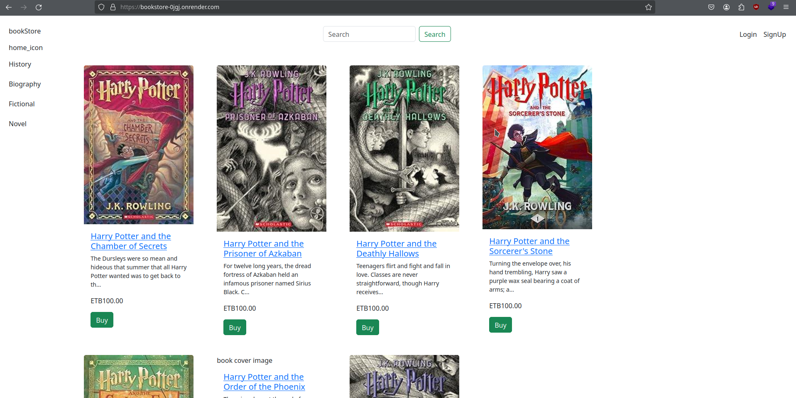

# bookStore

### Project Overview

Django learning project.



**bookStore** is a django based book store  website you can check it out [here](https://bookstore-0jgj.onrender.com/) "bookStore").

### Prerequisities

- Python3
- PostgreSQL DB
- Chapa test account

### Installation And Setup

1. Clone this repo
2. Craete your own virtual enviroment and activate it
3. Install all requirments by running

   ```
   pip install -r requirements.txt
   ```
4. Configure PostgreSQL DB locally or on free other platforms like [render](https://render.com/ "render"), [neon](https://neon.tech/ "neon").
5. And save the following database info on your .env file, and update the settings.py file DATABASES accordingly.

   - database user name
   - database password
   - database port
   - database host
   - database name
6. Create [chapa](https://chapa.co/ "Chapa") account for test payment integration and save the API public and secret key as chapa_public_key and chapa_secret_key (you can name whatever you want but be sure to update that on your code too).
7. Run 

   ```
   python manage.py runserver
   ```

### Tech Stacks

- Django
- PostgreSQL
- Chapa

### API Endpoints

Currently the website is running based on bookStoreApp, but i also defined the API endpoints using DRF.

- **GET** */api/books/* - to list books
- **GET** */api/books/{id}* - to get details of one book
- **POST** */api/books/* - to creat new book
- **PUT** */api/books/{id}* - to get details of one book
- **DELETE** */api/books/{id}* - to get details of one book
- **GET** */api/category/* - to list of categories
- **GET** */api/category/{id}* - to get deatils of one category
- **POST** */api/category/* - to create new category
- **PUT** */api/category/{id}* - to get deatils of one category
- **DELETE** */api/category/{id}* - to get deatils of one category
- **GET** */api/author/* - to get list of authors
- **GET** */api/author/{id}* - to get details of one author
- **POST** */api/author/* - to create new author
- **PUT** */api/author/{id}* - to get details of one author
- **DELETE** */api/author/{id}* - to get details of one author
- **GET** */api/order/* - to list orders
- **GET** */api/order/{id}* - to get details of one order
- **POST** */api/order/* - to create new order
- **PUT** */api/order/{id}* - to get details of one order
- **DELETE** */api/order/{id}* - to get details of one order
- **GET** */api/review/* - to list orders
- **GET** */api/review/{id}* - to get details of one review
- **POST** */api/review/* - to create new review
- **PUT** */api/review/{id}* - to get details of one review
- **DELETE** */api/review/{id}* - to get details of one review
